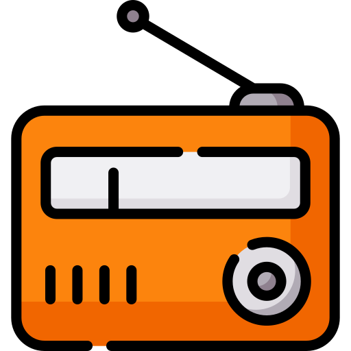

  
  <h2>إذاعة القرآن الكريم | Radio Quran</h2>
  
  

    <b>تطبيق ويب بسيط وسريع للاستماع لإذاعات القرآن الكريم المباشرة.</b>
  

  

    
  

---

## 📖 عن المشروع (About)
مشروع **Radio Quran** هو واجهة ويب تهدف لتسهيل الوصول إلى إذاعات القرآن الكريم بمختلف القراء والروايات. تم تصميم الموقع ليكون خفيفاً، سريع التحميل، وسهل الاستخدام على جميع الأجهزة.

## ✨ المميزات (Features)
* 🎧 تشغيل مباشر لإذاعات القرآن الكريم بجودة عالية.
* 📱 تصميم متجاوب يعمل على الهواتف وأجهزة الكمبيوتر (Responsive Design).
* ⚡ خفيف جداً ولا يستهلك الكثير من البيانات.
* 📋 قائمة تشغيل سهلة التنقل.

## 🛠 التقنيات المستخدمة (Built With)
تم بناء هذا المشروع باستخدام تقنيات الويب الأساسية لضمان السرعة والأداء:
*  **HTML5** - لهيكلة الصفحة.
*  **CSS3** - لتنسيق التصميم والجماليات.
*  **JavaScript** - للتحكم في مشغل الصوت والتفاعل.

## 🚀 طريقة التشغيل (How to Use)
يمكنك تصفح المشروع مباشرة عبر الرابط أعلاه، أو تحميل الملفات وتشغيلها محلياً:
1. قم بتحميل المشروع (Clone or Download).
2. افتح ملف `index.html` في أي متصفح.

---

  
تم التطوير بواسطة <a href="https://github.com/m23xp">m23xp</a>

